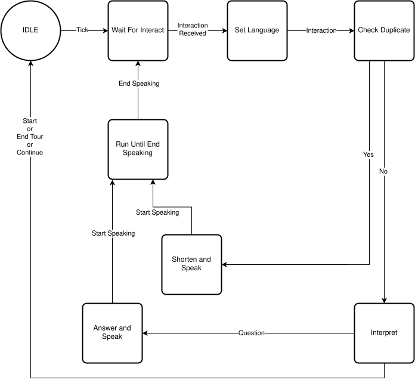

# scxml-tests
Basic tests to understand how qt scxml works. 

The code is characterized by the definition of a State Machine encoded in .scxml format and a main file to interact with the state machine and to log its state to check the correctness of the expected results.

In this case the State Machine is described by the DialogSkillAction SM, which describes a question-answer-based dialog between visitors and a robot guide, which is supposed to take place in the context of Palazzo Madama's Tour Guide Robot project.

This is just an example for now, you can edit the state machine and the interactions encoded inside the main file in order to test your own SM.

# Dialog State Machine
In order to make things a bit more clear, here is some information regarding the dialog state machine, so that someone can build its own SM starting from this. Visitors are supposed to ask information about anything related the museum, the tour and the robot itself, while the robot is supposed to provide answers and wait for other questions or deciding when continuing the tour. Here is a visual representation of the SM, along with a descprition of its states.

<!--  -->

    

The dialog skill behavior follows the flow chart presented above:
- The starting state is `IDLE`
- If a tick is received, then the `WaitForInteract` state is supposed to wait for the text and to pass it to the next state. If not, wait. When a text interaction is received, go to the next state.
- The `SetLanguage` state takes the interaction and sets the language based on the question (Does it make sense? Couldn't we use the LLM just reply in the language of the question?). Then go to the next state
- The `CheckDuplicate` state is supposed to recognize if the semantical meaning of the received question sentence has already been heard within the dialog.
- If it's the first time that the question has been asked, then go to the `Interpret` state, which is supposed to understand if the sentence is another question or the invite to continue the tour. If the sentence is a question, then go to the `AnswerAndSpeak` state, otherwise it means that one among the invitation to continue, starting or ending the tour has been received, therefore come back to the `IDLE` state.
- If a similar question has already been asked within the dialog session, the `ShortenAndSpeak` is supposed to provide a resumed version of the previous answer, rather than replying the same information. After generating the answer, speak and at the end of the speech, come back to the state `WaitForInteraction`
- The `AnswerAndSpeak` state is supposed to generate an answer and to estate it verbally. Analogously to the `ShortenAndSpeak` state, at the end of the speech, come back to the `WaitForInteraction` state
